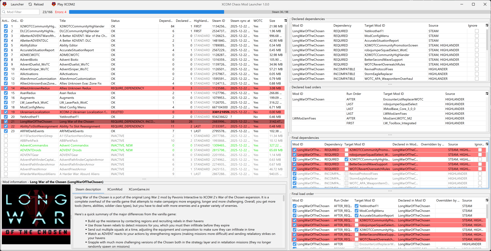
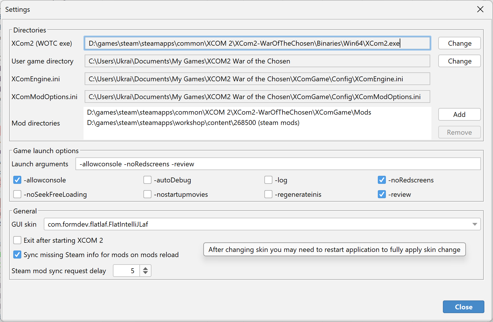
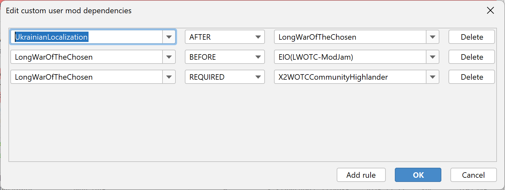

# Chaos XCOM 2 Launcher

This is cross-platform Java launcher for XCOM 2 (WotC) focused on managing mods, resolving mod load order and visualizing dependency errors.

The launcher guarantee mods load order as it is shown in order column.

This launcher helps you to:
- Automatically resolve mod load order using declared dependencies (Steam, X2WOTCCommunityHighlander, and user rules).
- Specify manual mod load order and save it.
- Show dependency problems (missing required mods, incompatible mods, cycles and more) and allow to resolve issues.
- Inspect mod metadata and XComGame.ini (when present).
- Read steam mod descriptions and other metadata.
- Launch XCOM 2 with the prepared mods.

The launcher is written in Java, so it runs on Windows and Linux.
* On Windows the launcher runs best.
* On Linux works, but play button don't work. Steam now uses Proton to run XCOM 2, thus play button in launcher is not working, but when play button is pressed the launcher will prepare mods and game config files well. After that you just need to start the game from the Steam (or in another way) without its native mod launcher to use prepared mods config.

Screenshots
-----------

Using the launcher
------------------
- Point the launcher to your XCOM 2 executable under Settings → Directories.
- Add one or more directories where your mods are located (these can be Steam workshop folders or local mod folders).
- Click "Reload mods" (or restart) to parse and load all mods.
- The main mods table shows mod title, ID, active/inactive status, load order, errors and more.
- Use the dependency and load order tabs to inspect why a mod is flagged with error and try to resolve load order manually for such mods.
- Note, the launcher don't handle duplicated mods, if duplicate is present it will allow to use only first mod with such ID.

Download 
--------
https://github.com/Chaos-UA/chaos-xcom2-launcher/releases

Enjoy XCOM 2!
